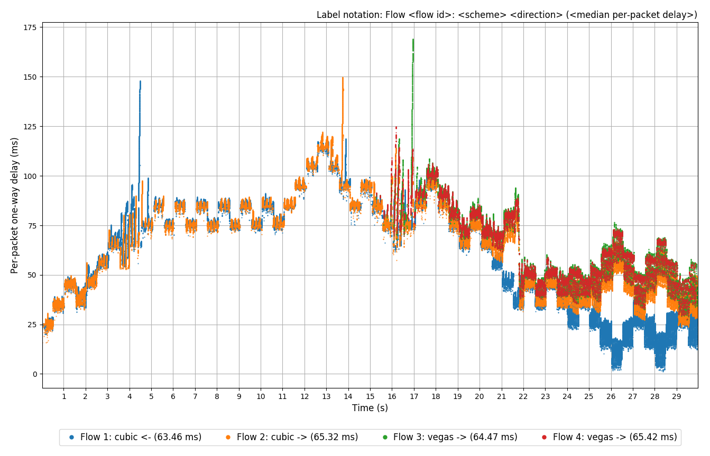

# CoCo-Beholder: Highly-Customizable Testing of Congestion Control Algorithms

[1]: #coco-beholder-highly-customizable-testing-of-congestion-control-algorithms
[2]: https://github.com/StanfordSNR/pantheon#dependencies "Pantheon dependencies"
[3]: https://bugs.launchpad.net/bugs/1783822 "Tc qdisc NetEm Delay Jitter Bug"
[4]: https://pantheon.stanford.edu/faq/#tunnel "Pantheon FAQ: Tunnel"
[5]: https://github.com/mininet/mininet "Mininet on Github"
[6]: https://pantheon.stanford.edu "Pantheon of Congestion Control"
[7]: https://doi.org/10.13140/RG.2.2.26079.61609 "doi:10.13140/RG.2.2.26079.61609"

```

                           ----    0-TH SEC:    ----
<--------------------------|  |                 |  |<-------------------CUBIC
                           |  |      500ms      |  |
CUBIC--------------------->|  |      ^^^^^5ms   |  |------------------------>
                           |  |  10ms|   |      |  |
                           |  |---120Mbps,20ms--|  |
                           |  |                 |  |
                           |  |    15-TH SEC:   |  |
VEGAS---120Mbps,2000pkts-->|  |                 |  |--120Mbps,5ms,3000pkts-->
                           |  |                 |  |
VEGAS---120Mbps,2000pkts-->|  |                 |  |--120Mbps,5ms,3000pkts-->
                           ----     30 SECS     ----
                    
```                
CoCo-Beholder is a human-friendly virtual network  emulator providing the 
popular dumbbell topology of any size. Each link of the topology may have 
individual  rate, delay, and queue size. The central link may also have a 
variable delay with optional jitter. Flows of different schemes may run together 
in the topology for a specified runtime of seconds. For each flow, its direction 
and starting second of the runtime  can be chosen.

Each flow has a host in the left half and a host in the right half of the 
topology and the hosts exchange a scheme's traffic with one host being the 
sender and one being the receiver. There is the left router that interconnects 
all the hosts in the left half and the right router that interconnects all the 
hosts in the right half of the topology. All the flows share the common central 
link between the two routers.

### Table of Contents
**[Testing](#testing)**<br>
**[Analysis](#analysis)**<br>
**[Plots and Statistics Generation](#plots-and-statistics-generation)**<br>
**[Installation](#installation)**<br>
**[Troubleshooting a Scheme](#troubleshooting-a-scheme)**<br>
**[Adding a New Scheme](#adding-a-new-scheme)**<br>
**[Python Support](#python-support)**<br>
**[Third-Party Libraries](#third-party-libraries)**<br>
**[Authorship](#authorship)**<br>
**[Contact](#contact)**<br>

## Testing

This command specifies the path to the [collection](#installation) containing 
the schemes to test and runs the testing for 30 seconds, with the central link 
having 120  Mbps rate and the variable delay (the base delay 20 ms, delta 
500 ms, step 10 ms, jitter 5 ms):

```bash
./run.py -p ~/pantheon 20ms 0.5s 10ms 5ms -t 30 -r 120 -s 12345
```

If this is the first run of the script, the default layout file `layout.yml`, 
shown below, is generated and used. The resulting testing setup is present in 
the [drawing][1] of the dumbbell topology at the top of this page. The layout 
file can be edited to get much more complex testing setups with more flows 
belonging to various schemes and having diverse network settings.

```yaml
# Delays/rates are optional: if lacking or null, they are set to 0us/0.0
# and for netem, to set delay/rate to zero is same as to leave it unset.
# Sizes of queues are optional: if lacking or null, they are set to 1000.
- direction: <-
  flows: 1
  left-delay: null
  left-queues: null
  left-rate: null
  right-delay: null
  right-queues: null
  right-rate: null
  scheme: cubic
  start: 0
- direction: ->
  flows: 2
  left-delay: 0us
  left-queues: 2000
  left-rate: 120.0
  right-delay: 5ms
  right-queues: 3000
  right-rate: 120
  scheme: vegas
  start: 15
- direction: ->
  flows: 1
  scheme: cubic
  start: 0
```

The rate, delay, and queue size are always installed **at both the interfaces** 
at the ends of each link in the topology using `tc` qdisc NetEm link emulator. 
In particular, this means that the RTT of a link is twice the (one-way) delay. 
Only the central link may have two different queue sizes of the interfaces at 
its ends – see `-q1`, `-q2`, `-q` arguments in the help message of the script.
By default, both the queues are of 1000 packets.

The variable delay at the central link is defined by four positional arguments:
the base delay, delta, step, and jitter, where the jitter can be skipped. Each
delta time, the delay is increased or decreased by step depending on a 
pseudorandom generator, whose seed can be specified with `-s` argument or is 
assigned the current UNIX time. To have a constant delay at the central link, 
choose the delta >= the runtime `-t`.

Into a chosen output directory, `metadata.json` file is written containing
**all** the parameters of the test, including the generator seed. The file may 
be fed to CoCo-Beholder in the future to fully reproduce the test. Also, during 
the testing, PCAP dump files are recorded at all the hosts of the dumbbell 
topology into the output directory using `tcpdump`. So for the example in the
[drawing][1], eight PCAP dump files were recorded.

**Note #1:** The maximum delay for every link – side and central (jitter not 
counted) – can be specified with `-m` option. To have a square-wave delay at 
the central link, set the maximum delay to the sum of the base delay and step.

**Note #2:** The testing script calls `setup_after_reboot` on Pantheon wrapper 
of each scheme in the layout file before launching any flows of the schemes, 
so the user does *not* have to manually set schemes up after every reboot.

## Analysis

Analysis script only accepts two arguments: the input folder and output folder 
– `dumps` and `graphs/data` by default. 

First, the script simply copies the metadata file from the input folder into 
the output folder. Then, the script processes a pair of PCAP dumps 
`<flow's starting #>-<scheme>-<sender/receiver>.pcap` of each flow and extracts 
information on the flow's packets into the flow's individual json data log file. 
E.g., for two ~12 GB dumps, one ~300 MB data log file is produced. 

The partial output of the analysis script for the example in the [drawing][1]:

```bash
./analyze.py

cubic scheme, flow 1:

sender   dump: 100.0% in 5.18s

Total: 222667 pkts/224631734 bytes, from sender: 144906 pkts/219351284 bytes

receiver dump: 100.0% in 5.37s

Total: 222245 pkts/223376026 bytes, from sender: 144052 pkts/218058328 bytes

♥ Union of data from sender recorded on both sides: 144906 pkts/219351284 bytes
♦ Subset of ♥ which was not recorded at sender    : 0 pkts/0 bytes
♣ Subset of ♥ which was not recorded at receiver  : 854 pkts/1292956 bytes
♠ Loss (ratio of ♣ bytes to ♥ bytes)              : 0.589%

Saving the data of the flow to the file...

==========================================

# and so on for the three more flows...
```

For forthcoming plots and statistics generation, the PCAP dumps are not needed 
anymore. The analysis of the PCAP dumps is performed only once, and then the 
plotting script may be run as many times as needed over the data log files to 
produce various plots quickly.

## Plots and Statistics Generation



Plotting script `plot.py` reads data log files of the flows and generates 
plots and statistics into the output folder (`graphs` by default). Different 
types of plots and statistics can be generated:

```
  -f, --per-flow        Graphs and stats are generated per flow, i.e. each
                        graph has a separate curve per flow
                        
  -t, --total           Total graphs and stats are generated for all flows
                        altogether, i.e. each graph has only one curve
                        
  -s "FIELD1 FIELD2...", --per-subset "FIELD1 FIELD2..."
                        Graphs and stats are generated per subset, i.e. each
                        graph has one curve per subset. Flows are in one
                        subset if they have the same values of the chosen
                        layout field(s). E.g. for -s "scheme direction", each
                        graph will have one curve per subset of flows having
                        both the same scheme name and direction. Currently
                        allowed layout fields: ['scheme', 'direction'].
```

For a selected type, three line plots and one scatter plot are generated:
* average throughput       
* average one-way delay    
* average Jain's index     
* per-packet one-way delay

E.g., [above](#plots-and-statistics-generation), one can see the per-flow 
per-packet one-way delay plot for the setup in the [drawing][1].

Average plots are averaged per an aggregation time interval: any positive float
number supplied with `-i` argument or 0.5 second by default.

Average Jain's index plot always contains one curve that is computed over the 
curves present in the corresponding average throughput plot.

Arguments `-c` and `-j` allow changing colors of the curves in plots flexibly.

---------------------------------------

For a selected type, the statistics file is generated. It does **not** depend on
the chosen aggregation interval and contains:

* each curve's overall average throughput over the curve's whole duration (Mbps)
* each curve's overall average one-way delay over all the curve's packets (ms)
* each curve's overall median, average, and 95th percentile per-packet one-way 
  delays over all the curve's packets (ms)
* overall Jain's index value for all the curves together, computed over the 
  average throughput statistics of the curves

The overall average one-way delay and overall average per-packet one-way delay 
of a curve are the same values computed in different ways.

## Installation

The installation process is as follows:

* Install [Pantheon][6] collection of congestion control schemes and, if needed, 
[add](#adding-a-new-scheme) more schemes to the collection locally

* Install CoCo-Beholder emulator using its installation script

* Done. [Test](#testing) the schemes in the collection using CoCo-Beholder.

Installing CoCo-Beholder itself is trivial, and its installation script 
`install.sh` is super easy and short. However, installing Pantheon collection 
of schemes often causes lots of problems. Besides, some Linux distributions 
just have bugs. Thus, please, see the detailed instructions for installation on 
[Ubuntu 16.04](#installation-on-ubuntu-1604-lts), 
[Ubuntu 18.04](#installation-on-ubuntu-1804-lts), and
[Debian 10](#installation-on-debian-10).

### Installation on Ubuntu 16.04 LTS

<details><summary>Please, click to expand.</summary><br></br>

The instructions below were tested on the VM with a fresh install of Ubuntu 
16.04.6-desktop-amd64 (Nov. 2019).

* As a general note: if you need bbr (TCP BBRv1.0) scheme make sure to use 
Linux kernel >=4.9.

* Fresh releases of 16.04 LTS (16.04.5 and higher) come with Linux kernel 4.15. 
CoCo-Beholder uses **tc qdisc NetEm delay jitter** that is [broken][3] on 
Ubuntu kernel 4.15. The solution:

  * Please, install 4.13 kernel to have the jitter:

   ```bash
   sudo apt-get install linux-image-4.13.0-39-generic linux-headers-4.13.0-39 \
   linux-headers-4.13.0-39-generic linux-image-extra-4.13.0-39-generic
   ```
  * In file `/etc/default/grub`, comment out the line `GRUB_HIDDEN_TIMEOUT=0` 
  and run the command `sudo update-grub`. This will allow you to see Grub menu 
  after the reboot.

  * Reboot and in Grub menu, choose `Advanced options for Ubuntu` and 
  there `Ubuntu, with Linux 4.13.0-39-generic`. Check the running kernel with 
  the command `uname -ar`.

* Download Pantheon git repository and git submodules of the included schemes:

```bash
git clone https://github.com/StanfordSNR/pantheon.git && cd pantheon
git submodule update --init --recursive
```

* Prevent Pantheon from applying the patches [reducing MTU][4] of some schemes:

```bash
rm -r src/wrappers/patches
```

* The installation of Pantheon and of the included schemes is described [here][2].
You can skip the installation of Pantheon itself (with  its 
`tools/install_deps.sh` script). You need to install only the schemes using the 
commands below. If the last command gives you an error like 
`Command "python setup.py egg_info" failed with error code 1...`, then execute 
`sudo pip install --upgrade pip` and repeat the failed command.

```bash
sudo apt-get install autoconf                              # for verus
sudo apt-get install nodejs-legacy                         # for webrtc
sudo apt-get install python-pip && sudo pip install pyyaml # for setup.py

src/experiments/setup.py --install-deps (--all | --schemes "<cc1> <cc2> ...")
src/experiments/setup.py --setup (--all | --schemes "<cc1> <cc2> ...")
``` 

* Leave Pantheon git repository, download CoCo-Beholder git repository, and run 
CoCo-Beholder installation script:

```bash
cd coco-beholder && sudo ./install.sh
```

Now you are ready to [test](#testing) the schemes.

</details>

### Installation on Ubuntu 18.04 LTS

<details><summary>Please, click to expand.</summary><br></br>

The instructions below were tested on the VM with a fresh install of Ubuntu 
18.04.3-desktop-amd64 (Nov. 2019).

* As a general note: if you need bbr (TCP BBRv1.0) scheme make sure to use 
Linux kernel >=4.9.

* Ubuntu kernel 4.15 has the [bug][3]. With Ubuntu >=18.04.3, you get 
kernel >=5.0 so, please, proceed to the next step.

* Download Pantheon git repository and git submodules of the included schemes:

```bash
git clone https://github.com/StanfordSNR/pantheon.git && cd pantheon
git submodule update --init --recursive
```

* Prevent Pantheon from applying the patches [reducing MTU][4] of some schemes:

```bash
rm -r src/wrappers/patches
```

* The installation of Pantheon and of the included schemes is described [here][2].
You can skip the installation of Pantheon itself (with  its 
`tools/install_deps.sh` script). You need to install only the schemes using the 
commands below.

```bash
sudo apt-get install autoconf                              # for verus
sudo apt-get install python-pip && sudo pip install pyyaml # for setup.py

src/experiments/setup.py --install-deps (--all | --schemes "<cc1> <cc2> ...")
src/experiments/setup.py --setup (--all | --schemes "<cc1> <cc2> ...")
``` 

* Leave Pantheon git repository, download CoCo-Beholder git repository, and run 
CoCo-Beholder installation script:

```bash
cd coco-beholder && sudo ./install.sh
```

Now you are ready to [test](#testing) the schemes.

</details>

### Installation on Debian 10

<details><summary>Please, click to expand.</summary><br></br>

The instructions below were tested on the VM with a fresh install of Debian 
10.1.0-amd64-netinst (Nov. 2019).

* As a general note: if you need bbr (TCP BBRv1.0) scheme make sure to use 
Linux kernel >=4.9.

* Ubuntu kernel 4.15 has the [bug][3]. It is not clear if Debian kernel 4.15 
has this issue. Anyway, with Debian >=10.1.0, you get kernel >=4.19 so, please, 
proceed to the next step.

* Download Pantheon git repository and git submodules of the included schemes:

```bash
git clone https://github.com/StanfordSNR/pantheon.git && cd pantheon
git submodule update --init --recursive
```

* Prevent Pantheon from applying the patches [reducing MTU][4] of some schemes:

```bash
rm -r src/wrappers/patches
```

* The installation of Pantheon and of the included schemes is described [here][2].
You can skip the installation of Pantheon itself (with  its 
`tools/install_deps.sh` script). You need to install only the schemes. First, 
install the dependencies of the schemes:

``` bash
sed -i 's/chromium-browser/chromium/g' src/wrappers/webrtc.py # for webrtc
sudo apt-get install python-pip && sudo pip install pyyaml    # for setup.py

src/experiments/setup.py --install-deps (--all | --schemes "<cc1> <cc2> ...")
```

* Add the string `export PATH=/usr/sbin:$PATH` to your `~/.bashrc` file and run 
the command `source ~/.bashrc`. This will enable `/usr/sbin/sysctl` utility, 
which is necessary not only during the installation but also later on.

* To build Verus, you need to downgrade your alglib library. So, please, add 
`deb <URL> stretch main` line to your `/etc/apt/sources.list` and run:

```bash
sudo apt-get update
sudo apt-get remove libalglib-dev             # remove  3.14 version
sudo apt-get install -t stretch libalglib-dev # install 3.10 version
```

* Now setup the schemes (build their source code, install certificates, etc.):

```bash
sudo apt-get install autoconf                             # for verus
myregex='s/milliseconds(\(.\+\))/milliseconds(int(\1))/g'    
sed -i $myregex third_party/verus/src/verus_client.cpp
sed -i $myregex third_party/verus/src/verus_server.cpp 

sudo apt-get install pkg-config                           # for sprout

sudo apt-get install libtinfo5                            # for quic
# During the setup, do not be afraid of CERTIFICATE_VERIFY_FAILED errors by quic

src/experiments/setup.py --setup (--all | --schemes "<cc1> <cc2> ...")
``` 

* Leave Pantheon git repository, download CoCo-Beholder git repository, and run 
CoCo-Beholder installation script:

```bash
cd coco-beholder && sudo ./install.sh

# matplotlib will give Python backports.functools_lru_cache error. To solve:
sudo pip install arrow==0.12.0
```

Now you are ready to [test](#testing) the schemes.

</details>

## Troubleshooting a Scheme

<details><summary>Please, click to expand.</summary><br></br>

* The first way is to launch a scheme on localhost without an emulator. This
enables to see the output of the scheme:

```bash
cd pantheon
src/wrappers/vegas.py setup_after_reboot # setup the scheme once after reboot
src/wrappers/vegas.py run_first          # who is server: sender or receiver
# receiver
src/wrappers/vegas.py receiver 54321         # start server in one shell
src/wrappers/vegas.py sender 127.0.0.1 54321 # start client in another shell
sudo pkill -9 -f vegas                       # kill all the started processes
```

* The second way is to make CoCo-Beholder show the output of schemes. Change its 
source code, as shown below, and run schemes [as usual](#testing).

```bash
cd coco-beholder
myregex='s/(\(.\+\)).pid/(\1, stdout=None, stderr=None).pid/g'
sed -i "$myregex" variable_delay/src/test/test.py
```

</details>

## Adding a New Scheme

<details><summary>Please, click to expand.</summary><br></br>

If you want to test a scheme that is not present in Pantheon collection you can 
add it locally as follows:

* Suppose you want to add TCP CDG. Check if the module is present in your kernel:

```bash
find /lib/modules/`(uname -r)`/kernel -type f -name *cdg*
# /lib/modules/4.19.0-6-amd64/kernel/net/ipv4/tcp_cdg.ko
```

* Add a new `cdg` entry to `pantheon/src/config.yml` file that keeps the list 
of all the schemes in the collection. The color, name, and marker can be any 
because CoCo-Beholder does not read them.

```yaml
  cdg:
    name: TCP CDG
    color: red
    marker: 'x'
```

* Create the wrapper for cdg scheme as a modified copy of, e.g., vegas wrapper:

```[bash]
cp pantheon/src/wrappers/vegas.py pantheon/src/wrappers/cdg.py
sed -i 's/vegas/cdg/g' pantheon/src/wrappers/cdg.py
```

Now you can [test](#testing) cdg with CoCo-Beholder as usual by specifying cdg 
flows in the layout file.

</details>

## Python Support

CoCo-Beholder is ensured to work with Python 2.7, 3.5, 3.6, and 3.7. 
CoCo-Beholder's installation script `install.sh` installs Python 2 library 
dependencies by default. For Python 3, please, comment out the corresponding 
lines in the installation script.

## Third-Party Libraries

CoCo-Beholder utilizes [Mininet][5] library: 
its API that enables to create a virtual host as a UNIX shell in a separate 
network namespace, to create a veth pair link between a pair of virtual hosts, 
and  to launch processes at a virtual host. CoCo-Beholder does not use 
Controller, Switch, Topology, TCLink or other higher-level entities of Mininet.
To prevent any future compatibility issues and to make the installation of 
CoCo-Beholder easier, the needed parts of Mininet 2.3.0d5 are included in
CoCo-Beholder repository as a third-party library according to Mininet license.

## Authorship

**Evgeniya Khasina** implemented the program in the scope of the Master's 
[thesis][7] *"The CoCo-Beholder: Enabling Comprehensive Evaluation of Congestion 
Control Algorithms"* at Saarland University in 2019 under the supervision of
**Professor Anja Feldmann** and **Dr. Corinna Coupette** at 
Internet Architecture Department of Max Planck Institute for Informatics.

## Contact

For any questions on the program, you may write to me, Evgeniya Khasina, to my
[E-mail](mailto:jenya-100@yandex.ru) address.
